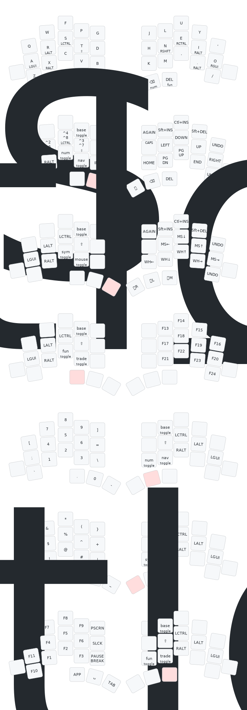

# Totem ZMK Configuration

Custom ZMK firmware configuration for the [GEIGEIGEIST Totem](https://github.com/GEIGEIGEIST/totem) split keyboard with **dual battery monitoring**.

## Features

- **Miryoku Colemak layout** for the Totem 38-key split
- **Dual battery monitoring** - Reports battery levels for both keyboard halves
- **Optional ZMK Studio support** that can be re-enabled if needed
- **7-layer Miryoku stack**: Base, Nav, Mouse, Trade, Num, Sym, Fun
- **Tap-preferred homerow mods** and layer-tap thumbs
- **Mouse, media, Bluetooth, and output controls**

## Layers

### BASE
Colemak alpha layer with homerow mods and Miryoku thumb keys.

### NAV
Navigation, selection shortcuts, arrows, paging, and caps word.

### MOUSE
Mouse movement, wheel controls, and mouse buttons.

### TRADE
Dedicated right-hand function layer with `F13` through `F24`.

### NUM
Number pad style layer with brackets and arithmetic symbols.

### SYM
Primary symbol layer for programming punctuation.

### FUN
Function keys, print screen, pause, and app/menu key.

## Keymap Visualization



## Installation

1. Fork this repository
2. Enable GitHub Actions in your fork
3. Modify `config/totem.keymap` as needed
4. Push changes to trigger automatic firmware build
5. Download firmware from Actions artifacts
6. Flash `totem_left-seeeduino_xiao_ble-zmk.uf2` to left half
7. Flash `totem_right-seeeduino_xiao_ble-zmk.uf2` to right half

## ZMK Studio

ZMK Studio is currently disabled to avoid the extra firmware overhead when it is not in use.

To re-enable it later:

- Uncomment `CONFIG_ZMK_STUDIO=y` in `config/totem.conf`
- Uncomment `snippet: studio-rpc-usb-uart` for `totem_left` in `build.yaml`
- Plug in the **left** half over USB when using Studio
- Make sure the keyboard output is set to USB when connecting with Studio over USB

## Hardware

- **Keyboard:** GEIGEIGEIST Totem (38-key split)
- **Controller:** Seeeduino XIAO BLE (nRF52840)
- **Firmware:** ZMK with Studio support

## Special Features

### Layout
- Miryoku Totem layout matching the rendered reference image
- Shift-modified Bluetooth keys clear the selected profile
- Shift-modified output toggle forces USB output

### Battery Monitoring
Configured for split battery level reporting to support peripheral battery monitoring apps.

## Changing the Keyboard Name

To change the Bluetooth device name:

1. Edit `config/totem.conf` and set:
   ```
   CONFIG_ZMK_KEYBOARD_NAME="Your Custom Name"
   ```

2. Build the firmware (GitHub Actions will create 3 files including `settings_reset`)

3. Flash the firmware:
   - Flash `settings_reset-seeeduino_xiao_ble-zmk.uf2` to both halves 
   - Flash `totem_left-seeeduino_xiao_ble-zmk.uf2` to left half
   - Flash `totem_right-seeeduino_xiao_ble-zmk.uf2` to right half

4. Clear Bluetooth bonds on the keyboard using `BT_CLR_ALL`

Note: The settings reset is required because the keyboard name is stored in persistent memory.
